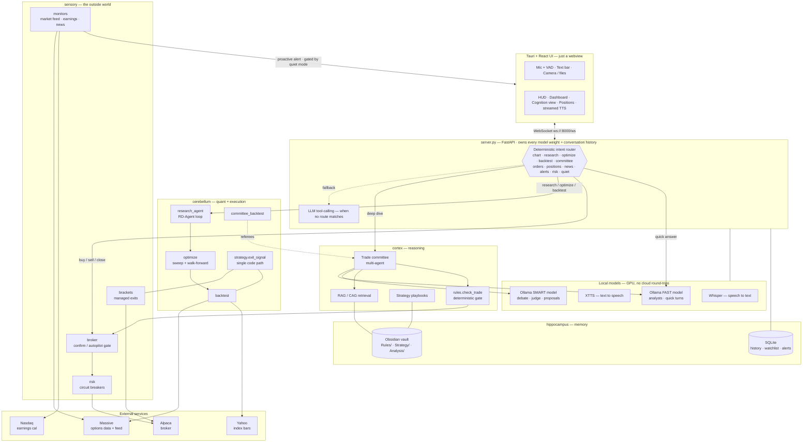
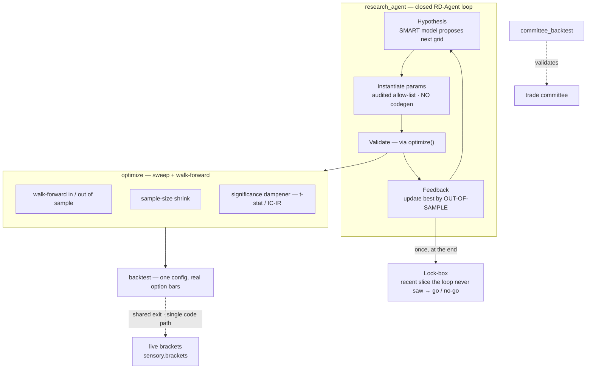

# HAL 9000 — Voice Assistant

Created by Jeffery Vincent

Local voice assistant with a HAL 9000 themed UI. Speaks via XTTS, listens via Whisper,
thinks via Ollama. Runs entirely on the host machine — no cloud round-trips.

## Architecture

Two completely decoupled processes:

```
+--------------------+         WebSocket          +-----------------------+
|  Tauri app (UI)    |  <--------------------->   |  server.py (FastAPI)  |
|  React + Vite      |   ws://localhost:8000/ws   |  Ollama / Whisper /   |
|  webview           |                            |  XTTS  — GPU heavy    |
+--------------------+                            +-----------------------+
        |                                                    |
   user keypress / mic                              .venv (fragile torch env)
```

- `server.py` owns all model weights and the conversation history.
- The Tauri app is just a webview. Open the browser at `http://localhost:1420` instead
  and you get the same UI.
- The WS client (`app/src/lib/ws.ts`) reconnects on every user action, so the
  two processes can start in either order.

## How HAL works (system map)

The brain-region module names are literal: **sensory** talks to the outside world,
**cortex** reasons, **cerebellum** runs the quant/execution machinery, **hippocampus**
remembers, **motor** draws. A turn enters `server.py`, hits a **deterministic intent
router** first (so quant/trade/UI commands behave predictably regardless of the LLM's
mood), and only falls back to LLM tool-calling when nothing matches.



### The trade committee (the multi-agent part)

A "deep dive" convenes a desk of agents — cheap **analysts in parallel** on the fast
model, then a **bull-vs-bear debate** and a **judge** on the smart model, then your
**deterministic rules gate** has the final, un-sweet-talkable word. It pins a verdict
and **places no orders**.

```mermaid
flowchart LR
  Q["Symbol under review"] --> A

  subgraph A["1 · Analysts — FAST model, parallel"]
    direction TB
    VOL["Vol — IV vs realized → rich / cheap"]
    SET["Setup — chain structure + liquidity"]
    CAT["Catalyst — journal / RAG"]
    ANA["Analysis — vault note, if any"]
    REG["Regime — deterministic Kaufman ER"]
  end

  A --> CONS["Consensus bias"]

  subgraph B["2 · Researchers — SMART model"]
    direction LR
    BULL["Bull case"]
    BEAR["Bear case"]
  end

  CONS --> B
  B --> REF["3 · Reflection<br/>past CLOSED trades on this name"]
  REF --> JUDGE["4 · Judge — SMART<br/>TRADE or PASS + thesis"]
  JUDGE --> GATE{"5 · Rules gate<br/>rules.check_trade"}
  GATE -->|"pass"| TRADE["TRADE verdict<br/>pinned in Trade Ideas · NO order placed"]
  GATE -->|"fail"| PASS["Forced PASS"]
```



### The quant research stack

Each layer is the referee for the one above it: a `backtest` runs one config, `optimize`
sweeps many with walk-forward + significance guards, and `research_agent` closes the loop
— the smart model proposes the next grid, the optimizer scores it, and a **held-back
lock-box** validates the winner once. The exit rule is a **single code path** shared by
backtests and the live trader, so a backtest exercises the exact logic that manages a
real position.



## Layout

```
hal-voice/
  server.py            FastAPI server, all AI logic
  start-hal.sh         Linux/macOS launcher: activates .venv, runs server.py, logs to hal.log
  static/              Legacy single-file UI (still served as a fallback)
  app/                 Tauri 2 + React + Vite frontend (current UI)
    src/               React components, stores, lib
    src-tauri/         Rust shell (window, tray, global shortcut, autostart)
```

## Setup (Linux)

One command from a **host terminal** (not the VSCode Flatpak terminal — it has no
`sudo`/`apt` and can't see the GPU):

```sh
./setup.sh
```

It installs system prereqs (python venv, ffmpeg, libsndfile), creates `.venv`,
installs GPU torch (CUDA 12.4) + the rest of `requirements.linux.txt`, sets up the
`app/` frontend, and installs Ollama. The Python requirements are regenerated from
`requirements.windows.txt` each run, so the two stay in sync.

Pull the LLM/vision models (~30 GB, separate step):

```sh
PULL_MODELS=1 ./setup.sh        # or: ollama pull qwen3.6:27b  (etc.)
```

## Development

### Server

```bash
./start-hal.sh                                   # launcher: venv + server, logs to hal.log
# or, in an already-activated shell:
source .venv/bin/activate && python server.py
```

Logs stream to `hal.log`. Server listens on `:8000`.

### UI — browser mode (fast iteration)

```bash
cd app
npm install        # first time only
npm run dev
```

Opens at `http://localhost:1420`. Vite proxies `/ws` to FastAPI on `:8000`.

### UI — native Tauri window

```bash
cd app
npm run tauri:dev
```

First run compiles the Rust shell (5–10 min). Subsequent runs are fast.

### Production build

```bash
cd app
npm run tauri:build
```

Produces a bundle in `app/src-tauri/target/release/bundle/` (AppImage + `.deb`
on Linux). Launch it once to register HAL for login autostart (see Auto-start
below).

## Network access (LAN)

`server.py` binds `0.0.0.0:8000`, so HAL is reachable from other devices once
you serve the UI from FastAPI and protect it with a password.

1. **Build the UI.** FastAPI serves `app/dist` when present (else the legacy
   `static/` UI):

   ```bash
   cd app && npm run build
   ```

2. **Set a password** in `.env`. Network devices must then log in; this machine
   (localhost + the Tauri app) is always exempt. Empty `HAL_PASSWORD` disables
   auth.

   ```ini
   HAL_PASSWORD=your-password-here
   HAL_SECRET_KEY=...   # python -c "import secrets; print(secrets.token_hex(32))"
   ```

3. **Connect.** Start the server, then open `http://<host-ip>:8000/` from any
   device on the network (e.g. `http://192.168.1.199:8000/`). A login page
   appears; after the password, the UI and its WebSocket are unlocked.

> **Security:** HAL runs commands with `AUTO_APPROVE_TOOLS = True`, so anyone who
> logs in can execute code on this machine. Use a strong password and only expose
> HAL on a trusted network. If a firewall is active, allow the port:
> `sudo ufw allow 8000/tcp`.

## Auto-start at logon

Two pieces, configured independently.

### 1. Server — systemd user service

Run the server with the launcher, which activates the venv and appends all
output to `hal.log`:

```bash
./start-hal.sh            # foreground
./start-hal.sh &          # or background it
```

To start it at login, add a user service at `~/.config/systemd/user/hal.service`
(replace the path with your checkout):

```ini
[Unit]
Description=HAL Voice Server
After=network.target

[Service]
WorkingDirectory=/path/to/hal
ExecStart=/path/to/hal/start-hal.sh
Restart=on-failure

[Install]
WantedBy=default.target
```

Enable it, and keep it running without an active login session:

```bash
systemctl --user daemon-reload
systemctl --user enable --now hal
loginctl enable-linger "$USER"
```

Check it (give it ~20s for model warmup):

```bash
systemctl --user status hal
curl -s -o /dev/null -w '%{http_code}\n' http://localhost:8000/
tail -f hal.log
```

### 2. App window — Tauri autostart plugin

Code lives in `app/src/App.tsx` and `app/src-tauri/src/lib.rs`. Guarded by
`import.meta.env.PROD` so `npm run tauri:dev` does not pollute startup.

After running `npm run tauri:build` and launching the installed app once, the
plugin registers HAL via an XDG autostart entry in `~/.config/autostart/`. Delete
that `.desktop` file (or remove it from your desktop's Startup Applications) to
disable.

### Startup order caveat

Server and Tauri window fire at roughly the same time. The server takes
10–30s to load Whisper / XTTS / Ollama weights. During that window the UI
will briefly show `ERROR / Connection failed`. Clicking the mic or sending
text once the server is ready triggers a fresh WS connect and recovers.

### Summon / hide from anywhere

`Ctrl+Space` toggles the HAL window — wired in `app/src-tauri/src/lib.rs`
via `tauri-plugin-global-shortcut`. Works even when the window is hidden.

## Features (UI)

- Voice loop: tap mic, speak, VAD detects end-of-utterance, server transcribes
  and replies with streamed TTS audio.
- Text directives via the bottom input bar.
- File attachments: drag-drop anywhere, file picker (`+`), or camera button.
- Camera-attach: one-shot photo snap (Cancel / Flip / Snap), separate from
  immersive live-vision mode.
- Immersive mode (eye icon): full-screen camera / screen share / map / external
  video as backdrop, with a "live cognition" overlay of HAL's tool calls.
- Conversations: switch / delete / new. Opened from the HUD's `CHATS` button.
- Telemetry panel: rolling log of tool calls (right edge, expandable).
- **Cognition view (`MIND` button):** a full-screen, JARVIS-style map of HAL's
  whole decision process. Each step is a floating 3D card in its actor's lane —
  **Human / HAL / Committee / Broker / Risk** — chained in time by glowing
  "pipes" with a pulse that carries your question from one actor to the next.
  A committee deep-dive streams as per-step cards (analysts → consensus →
  bull/bear → judge → rules gate), and opening it auto-triggers when the
  committee convenes. Click any card to **zoom in** (wheel / `+` `−` / Esc) for
  its full input/output; the newest card shimmers while HAL is mid-thought.
- **Dashboard (`DASHBOARD` button):** a single full-screen board — QuantDinger-
  style — that pulls together everything HAL computes: a **KPI strip** (equity,
  win rate with a gauge ring, profit factor, max drawdown, trades, open
  positions), the **price chart** with RSI/pivot + supertrend overlays and
  buy/sell markers, the latest **committee verdict** (TRADE/PASS/HOLD with a
  confidence ring + reasoning), the **backtest / optimizer** equity curve with a
  tearsheet, and **live positions + P&L**. Each tile reads whatever's currently
  loaded and shows a "say X to populate" hint when empty, so the board is useful
  before any data lands (e.g. *"optimize SPY"*, *"deep dive on AAPL"*, *"show me a
  chart of NVDA"*). HAL's red/amber CRT skin, not QuantDinger's. Open it with the
  HUD button or by voice (**"open the dashboard"** / **"close the dashboard"**);
  `Esc` also closes it.
- Fast / smart model toggle (lightning bolt).
- Wipe memory (trash icon).
- Stop button (interrupt speech/generation).
- **"Stop listening" button:** while HAL has the mic open, a stop button on the
  live mic visualizer stands the mic down immediately — no turn sent. One-shot,
  separate from the privacy latch (which keeps HAL from re-opening the mic).
- **Quiet mode (`QUIET` button):** do-not-disturb. Holds every proactive spoken
  alert (news / earnings / price / managed-exit) **and** stops HAL volunteering
  trade ideas, until you lift it. Bell-with-slash icon, glows amber when engaged.
  Distinct from voice-mute, which only silences TTS while alerts still fire.
- Fullscreen chat mode (hides the eye, expands transcript).

## Trading & committee commands to remember

HAL is voice/text driven — these are things to **say or type**, not CLI commands.
Phrasing is flexible; the examples below are what reliably routes to each tool.

### Order execution (Alpaca)

Paper vs live is set by `ALPACA_PAPER` in `.env` (defaults to **paper** — nothing
hits real money until you set it `false`). Orders go through a gate:

- **Confirm mode (default):** an order is *staged*, not sent. HAL reads it back;
  you then say **"yes / send it / confirm"** to fire it, or **"cancel that"** to drop it.
- **Autopilot mode:** orders submit immediately once they pass your rules **and the
  risk circuit breakers** (below). Switch by voice (**"turn on autopilot"** /
  **"go back to confirming"**) or with the **TRADER** toggle in the HUD (shows
  **MANUAL**, glows amber as **AUTOPILOT**).

| Say something like… | What it does |
| --- | --- |
| "Buy 10 shares of AAPL" / "Sell 2 SPY 580 puts for Friday" | Stages an equity or single-leg option order (`place_order`) |
| "Yes, send it" / "Confirm" | Submits the staged order (`confirm_order`) |
| "Cancel that" / "Never mind" | Discards a staged, unsent order (`cancel_pending_order`) |
| "Turn on autopilot" / "Go back to confirming" | Flips the order gate (`set_trade_mode`) |
| "What's my account / buying power?" | Alpaca account snapshot (`get_account`) |
| "What am I holding?" / "How are my positions?" / "What's my P&L?" | Live positions + P&L, read **straight from Alpaca** (deterministic route — HAL answers from the real account, never invents holdings) |
| "What orders are working?" / "Did it fill?" | Working/recent orders (`list_orders`) |
| "Cancel my AAPL order" | Cancels a live resting order (`cancel_order`) |
| "Close my AAPL" / "Flatten that" | Submits an offsetting order (gated like any order) |
| "Are we halted?" / "What are my risk limits?" | Reports the risk circuit breakers + kill-switch state (`manage_risk` status) |
| "Reset the kill switch" / "Re-enable trading" | Clears a latched daily-loss halt (`manage_risk` reset) |

**Positions panel (UI):** the **POSITIONS** button in the HUD opens a live panel
(equity, buying power, per-position P&L, PAPER/LIVE + gate badge). The **Close**
button there is a *manual override* — it sells immediately, bypassing the
confirm/autopilot gate (two-click confirm so it can't fire by accident). Use the
**A− / A+** control in its header to size the row text (remembered per browser);
the HUD's **TRADER** button flips the order gate (MANUAL ⇄ AUTOPILOT) from the
main screen.

`.env` keys: `ALPACA_API_KEY`, `ALPACA_SECRET_KEY`, `ALPACA_PAPER`, `ALPACA_AUTOPILOT`.

### Risk circuit breakers (portfolio-level safety)

A second safety layer in front of **new entries** (exits/closes are never blocked —
you can always de-risk). This is the runaway guard for autopilot: it caps the whole
account over time, independent of any single trade's merits. Four checks, each
disabled by setting its `.env` value to `0`:

- **Order-rate throttle** — at most N entries per rolling minute (`RISK_MAX_ORDERS_PER_MIN`).
- **Max open positions** — hard cap on concurrent holdings (`RISK_MAX_OPEN_POSITIONS`).
- **Max gross exposure** — total position value as a % of equity (`RISK_MAX_GROSS_EXPOSURE_PCT`).
- **Daily-loss kill switch** — once equity drops past the day's floor
  (`RISK_DAILY_LOSS_LIMIT_PCT`), it **latches**: new entries are blocked and
  autopilot drops back to confirm until you clear it. Resets automatically next
  trading day.

The HUD's **RISK** badge shows **ARMED**, and flips to a clickable **HALTED** when
the kill switch trips (click → confirm → cleared). You can also say **"are we
halted?"** / **"reset the kill switch."**

`.env` keys: `RISK_MAX_ORDERS_PER_MIN`, `RISK_MAX_OPEN_POSITIONS`,
`RISK_MAX_GROSS_EXPOSURE_PCT`, `RISK_DAILY_LOSS_LIMIT_PCT` (see `.env.example` for defaults).

### Pre-earnings IV-crush screener (automatic)

A background monitor that flags watchlist names reporting **soon** whose options
are **overpriced** — implied vol well above recent realized vol — the classic
pre-earnings setup the "skip earnings" rule exists to avoid. No command needed: it
scans your watchlist (the same list the news watcher uses) on an interval, pulls
the earnings calendar (keyless Nasdaq feed), and when a name reports within the
lookahead window **and** its IV reads RICH, HAL speaks a one-time heads-up — e.g.
*"AVGO reports in 2 days and options look overpriced…"* — and records it. One flag
per earnings event, so it won't nag. Silenced by **quiet mode** (below).

`.env` keys: `EARNINGS_POLL_SECONDS` (scan interval, default hourly),
`EARNINGS_LOOKAHEAD_DAYS` (how soon a report must fall to be in scope, default 3).

### Quiet mode (do-not-disturb)

One switch silences **both** things that interrupt you: every proactive spoken
alert (news / earnings / price / managed-exit) **and** HAL's unprompted
trade-pitching. It **latches until you lift it** (a server restart also clears it).
Direct requests still work — quiet only suppresses what HAL starts on its own.

| Say something like… | What it does |
| --- | --- |
| "Be quiet" / "Stand down" / "Do not disturb" / "Stop / turn off / disable / snooze the alerts" (an "overnight" qualifier is fine: *"turn off those overnight alerts"*) | Engages quiet mode |
| "Resume" / "Alerts back on" / "Noisy mode" / "Turn alerts back on" | Lifts it |

Or use the **QUIET** button in the HUD (bell-with-slash, glows amber when engaged).
Voice and button stay in sync, so a spoken toggle updates the button and vice-versa.

### Strategy playbooks (vault `Strategy/` folder)

`Rules/trading-rules.md` is HAL's **global** policy. Drop markdown files in a
`Strategy/` folder in the vault to define **per-setup playbooks** that override it
when their conditions match. Each file is one playbook with a fenced ` ```yaml `
block — `applies_to` conditions plus any parameter overrides:

```yaml
name: momentum-calls
applies_to:
  symbols: [NVDA, AAPL, MSFT]   # any of these tickers
  bias: [bullish]               # AND a bullish chart bias
  iv_regime: [low, mid]         # AND non-rich IV (RICH→high, FAIR→mid, CHEAP→low)
stop_loss_pct: 30               # overrides for this setup
take_profit_pct: 60
max_risk_per_trade_pct: 1.0
```

**Selection is automatic and deterministic:** on each trade idea HAL matches the
symbol, chart bias, and IV regime against every playbook; the **most specific**
match (most conditions satisfied) wins, and its parameters override the global
rules for sizing **and** exits. No match → the global rules stand. A playbook with
an empty `applies_to` never auto-selects. Because the whole trade path reads one
merged rules dict, **backtesting the same setup uses the same playbook levels**
(single source of truth). Watch the telemetry for a `trade.playbook` line when one
fires.

**Two halves — deterministic numbers + RAG prose:** the ```yaml block is parsed
*deterministically* (a stop level must never depend on an embedding score), but
the surrounding prose ("When to use / When NOT to use") lives in the vault, which
is HAL's RAG corpus — so the playbook's *reasoning* is retrievable when HAL thinks
about a name, even though its *parameters* are exact. Edit a `Strategy/*.md`, then
rebuild the RAG index (same as any vault note) to make new prose searchable.

**`applies_to` keys** (a condition matches when the trade's value is in the list;
all listed conditions must hold): `symbols` (tickers; omit to apply to any),
`bias` (`bullish`/`bearish`/`neutral`), `iv_regime` (`high`/`mid`/`low`).
**Override keys** (any omitted falls back to `trading-rules.md`): `stop_loss_pct`,
`take_profit_pct`, `max_risk_per_trade_pct`, `limit_buffer_pct`, `min_reward_risk`.

**On a single-name trade idea** (the quick sized long call/put, not the committee)
HAL also prints a **vol edge** — implied ATM IV vs 30-day realized vol, in vol
points (positive = premium is cheap for a long buyer; the options analog of a
model-minus-market spread) — and enforces two **account-level risk caps** while
sizing: `max_concurrent_risk_pct` (total stop-risk across all open positions) and
`max_correlated_risk_pct` (stop-risk in positions whose daily *returns* move with
the new name at |ρ| ≥ 0.70, so it won't quietly stack the same factor bet under a
second ticker). Whichever cap binds harder sizes the trade down — or to zero, with
the reason stated. `max_concurrent_risk_pct` defaults to 6%, and
`max_correlated_risk_pct` falls back to whatever the concurrent cap is; a playbook
may override either like any other key.

**Starter playbooks** ship in the vault's `Strategy/` folder — copy `_TEMPLATE.md`
to start your own:

| File | Fires when | Does |
| --- | --- | --- |
| `_TEMPLATE.md` | never (inert) | documented template to copy |
| `momentum-calls.md` | bullish AI/semis large-cap, non-rich IV | long calls, wider 30/60 exits |
| `index-etf-swing.md` | SPY/QQQ/IWM/DIA, directional | tight 20/20 index swing |
| `high-iv-credit.md` | any name, IV RICH | sell premium (defined-risk credit) |

### Analysis notes (vault `Analysis/` folder)

Where `Strategy/` holds reusable *playbooks*, `Analysis/` holds your **standing
trade ideas on a specific name** — the actionable read you'd put on right now.
Drop a markdown file per idea (copy `Templates/analysis.md`) with frontmatter HAL
keys off:

```yaml
type: analysis
symbol: AVGO          # the committee pulls notes by symbol
bias: bullish         # bullish | bearish | neutral
conviction: high      # high | med | low
status: active        # set `archived` to retire it — the committee then ignores it
```

The prose (setup / catalyst / trade idea / invalidation) is RAG-indexed like any
vault note, **and** the committee reads the folder directly: when an active note
exists for the name under review, it's surfaced as a dedicated **analysis** desk
voice (below). With nothing on file the committee is unchanged — no empty vote is
cast. The seed `AVGO.md` is a worked example.

### Multi-agent committee (deep analysis)

A heavier, slower workup than a quick trade idea: vol/setup/catalyst analysts (plus
a deterministic **regime** read of the price tape — trending up/down vs chop, via a
Kaufman efficiency ratio — and an **analysis** voice when the vault's `Analysis/`
folder has an active note on the name) → bull-vs-bear debate → head-trader judge →
your deterministic rules gate. Pins a TRADE-or-PASS verdict (with the full desk
reasoning) in the Trade Ideas pane and **places no orders**. The regime read is the
desk's one purely directional vote — it leans neutral in chop regardless of slope,
since trading a direction in a choppy tape is how breakout signals bleed to theta.

| Say something like… | What it does |
| --- | --- |
| "Deep dive on NVDA" / "What does the committee think about SPY?" | Full committee review (`committee_review`) |
| "Backtest the committee on AAPL from 2025-09-01 to 2026-03-01" | Validates its directional calls (`committee_backtest`) |

The backtest defaults to the **cheap baseline arm (no LLM)** — run that first to
see if the signals predict direction at all. Add **"the full version"** to also run
the (slow) LLM arm. It's a *directional proxy*, not options P&L — see the module
docstrings in `hal/cerebellum/committee_backtest.py` for the honest caveats. Each arm
is also scored by **IC (Information Coefficient)** — the correlation between the side
it took and the realized forward move, with a significance t-stat. Unlike hit-rate
(which ignores *how far* price moved) IC is scale-free, so it's comparable across
symbols and windows; it's the rigorous form of the "does this signal predict
direction?" question the backtest exists to answer. Each arm also carries a
**Brier score** and its **skill score** — the calibration lens. Every directional
call becomes a probability from its conviction (the baseline arm from analyst
agreement, the committee arm from its 0-100 score), scored against the realized
0/1 move, so a confident miss is punished harder than a hedged one. Where hit-rate
asks *right or wrong?*, Brier asks *was the confidence earned?* — and skill > 0
means the arm is better-calibrated than just predicting the base rate.

**Strategy backtest panel** (the equity curve HAL shows when it backtests an
underlying's option strategy, e.g. during a deep analysis): the stats overlay now
includes a tearsheet row — per-trade **Sharpe / Sortino**, **payoff ratio**,
**expectancy**, **max-drawdown %**, and **avg win / loss** — alongside win rate and
profit factor. Its **stop / take-profit exits come from the same vault rules the
live trader uses** (`stop_loss_pct` / `take_profit_pct` in `Rules/trading-rules.md`),
so a backtest validates the exit policy you actually run. Edit those percentages and
both the backtest and live brackets move together.

### Strategy optimizer (parameter sweep + walk-forward)

Where a backtest runs **one** fixed configuration, the optimizer **sweeps** the
strategy's knobs — RSI period, pivot window, RSI thresholds, stop / take-profit
percentages — scores every combination, and surfaces the ones that actually hold up.

| Say something like… | What it does |
| --- | --- |
| "Optimize SPY" / "Tune the strategy on QQQ" | Sweeps configs, speaks the verdict, drops a ranked leaderboard in chat |
| "Run a parameter sweep on the Dow" / "Grid search NVDA" | Same route (`optimize`), any phrasing that names the sweep |

Three guards against the classic optimizer trap — curve-fitting a number that won't
repeat live:

- **Walk-forward split.** Every config is scored on an **in-sample** slice (the older
  ~70% of the window) and *separately* measured on the **out-of-sample** tail it never
  influenced. The leaderboard's **Held up?** column flags configs whose edge survived
  out-of-sample; if none do, HAL says so plainly and tells you *not* to trade them —
  the signal needs rethinking, not just retuning.
- **Sample-size shrink.** A profit factor on three trades is noise, so thin configs
  are shrunk in the ranking and can't top the board on a lucky handful.
- **Significance dampener.** Profit factor measures the *size* of an edge, never
  whether it's real. Borrowing qlib's IC-IR lens, each config is scaled by the
  **t-stat** of its trade returns (the leaderboard's **IS t** column); a config whose
  per-trade edge can't be told from zero — |t| under ~2 — is faded down the board no
  matter how high its profit factor. This matters most as the referee for the research
  agent below, which is only as trustworthy as the number it maximizes.

The sweep is **API-frugal**: contract discovery and option-bar fetches (the expensive
Massive calls) are cached and shared across every combination, so a ~100-config sweep
costs roughly one backtest's worth of API, not a hundred. The winning config's equity
curve is pushed to the **strategy backtest panel** so the leaderboard has a picture to
go with the verdict. An optional, explicitly-gated LLM review of the tearsheet
(`ai_optimize(..., confirm_llm_usage=True)`) can suggest where to search next — off by
default so it never burns the smart model by surprise.

### Closed-loop research agent (RD-Agent)

An autonomous evolution of the optimizer, adapted in spirit from Microsoft qlib's
**RD-Agent**. Where the optimizer sweeps **one** grid you hand it, the research agent
runs the loop a human runs by hand: it reads the leaderboard, the smart model proposes
the *next* grid plus a one-line thesis, the optimizer scores it, and it repeats —
converging on configs that hold up, or stopping early when the evidence says there's
no real edge to find.

| Say something like… | What it does |
| --- | --- |
| "Research the strategy on SPY" / "Run the RD-agent on QQQ" | Runs the closed RD-Agent loop, speaks the verdict, drops the round-by-round report + lock-box result in chat |
| "Evolve the strategy for NVDA" / "Auto-tune the Dow" / "Deep optimize SPY" | Same route (`research`), any phrasing that asks to *search* the strategy rather than run one config |

The spoken command **is** the opt-in for the smart-model spend (the library gate
below) — so a voice run is confirmed automatically but capped at a modest round budget.
The winning config's equity curve is pushed to the **strategy backtest panel**, same as
the optimizer. It's the heaviest trading route HAL has (several rounds, each a sweep +
a smart-model call), so it announces a few-minute runtime up front.

For scripting (or a wider, uncapped search) call it directly — the library entrypoint
is gated behind `confirm_llm_usage` so it never burns the smart model by surprise:

```python
from hal.cerebellum import research_agent
result = await research_agent.research("SPY", months=24, max_rounds=4,
                                       confirm_llm_usage=True)
print(result["report"])      # round-by-round trail + the lock-box verdict
```

Three things keep an LLM-driven search honest:

- **Parameters only — never code.** The model may only pick values inside an audited
  allow-list (the same RSI / pivot / stop / TP knobs); it never authors signal or exit
  code, so `generate_signals` stays fixed. This is the deliberate line vs qlib's
  RD-Agent, which evolves executable factor code — HAL's output can reach a real broker.
  A malformed proposal falls back to a deterministic perturbation of the current best,
  so a flaky model just makes a round dumber, it can't break the loop.
- **The optimizer is the referee.** The model proposes experiments; the deterministic
  walk-forward + significance objective scores them. It can never grade its own work.
- **A lock-box slice.** A recent window (default 3 months) is **held back before the
  loop starts**, and the single chosen config is tested on it **exactly once** at the
  end. If the model steered by out-of-sample every round, out-of-sample would quietly
  become in-sample — the lock-box is the one slice the search never touched, and its
  number is the only go/no-go. Disagreement with the in-loop result means the loop
  overfit itself → verdict is *do not trade*.

Gated behind `confirm_llm_usage` and bounded by `max_rounds` (cost = at most that many
smart-model calls; the Massive sweep is shared across rounds via persistent caches). It
produces a research artifact and at most **one** candidate flagged for paper-forward —
it never wires a trigger and never places a trade.

> The committee and Alpaca tools only work after the venv is rebuilt against
> Python 3.13 and `alpaca-py` is installed (both handled by `./setup.sh`).

## Known things to know

- **Torch env is fragile.** The `.venv` has a hand-pinned `torch / torchaudio /
  torchcodec / FFmpeg` matrix (see `setup.sh` for the exact CUDA pins). Do not
  blindly `pip upgrade`.
- **VRAM budget.** RTX 3090 (24 GB) is shared between Ollama LLM, Whisper, and
  XTTS. Loading a larger LLM may starve TTS.
- **Map embed has no API key.** `app/src/components/immersive/ImmersiveStage.tsx`
  uses the keyless `maps.google.com/maps?q=...&output=embed` URL. Swap in
  `https://www.google.com/maps/embed/v1/place?key=...&q=...` if Google starts
  rate-limiting you.
- **Two GitHub remotes exist:** the clean `hal` repo (default) and the bloated
  `hal-voice` repo (has secrets in history — do not push to).

## Repo layout reference

Key files when something breaks:

| File | Purpose |
| --- | --- |
| `server.py` | FastAPI WS server, all model invocation |
| `start-hal.sh` | Venv activation + server launch (Linux) |
| `hal/sensory/broker.py` | Alpaca client + confirm/autopilot order gate |
| `hal/sensory/risk.py` | Pre-trade risk circuit breakers (throttle, exposure, daily-loss kill switch) |
| `hal/sensory/money.py` | Decimal price/qty precision (venue tick rounding) |
| `hal/sensory/brackets.py` | HAL-managed option stop/TP exits (synthetic brackets) |
| `hal/sensory/earnings.py` | Pre-earnings IV-crush screener (Nasdaq calendar → IV-richness flag) |
| `hal/cerebellum/strategy.py` | Shared exit rule + levels + `OrderIntent` (backtest ↔ live single source of truth) |
| `hal/cerebellum/execution.py` | `Execution` protocol: `SimBroker` (backtest) + `LiveExecution` (live) |
| `hal/cerebellum/backtest.py` | Options strategy backtester + `StrategyParams` (tunable signal/exit knobs) |
| `hal/cerebellum/optimize.py` | Parameter sweep + walk-forward (in/out-of-sample) ranking over the backtester |
| `hal/cerebellum/research_agent.py` | Closed-loop RD-Agent: LLM proposes grids → optimizer referees → lock-box validates ("research SPY" route + library) |
| `hal/cortex/committee.py` | Multi-agent trade committee (analysts → debate → judge) |
| `hal/cerebellum/committee_backtest.py` | Committee backtest referee (baseline vs LLM) |
| `hal/cortex/rules.py` | Deterministic trading-rules gate (`check_trade`) + vault exit-policy source |
| `hal/cortex/strategies.py` | Vault `Strategy/` playbook loader + auto-match selection |
| `app/src/components/PositionsPanel.tsx` | Live positions UI + manual close override |
| `app/src/components/CognitionStage.tsx` | Full-screen Cognition view (decision-flow cards + pipes + zoom) |
| `app/src/components/Dashboard.tsx` | Full-screen dashboard (KPI strip + chart + committee verdict + backtest + positions) |
| `app/src/App.tsx` | Root layout, autostart hook, immersive thought mirroring |
| `app/src/lib/ws.ts` | WS client (binary audio + JSON envelopes) |
| `app/src/lib/audio.ts` | Gap-free WAV chunk playback queue |
| `app/src/lib/vad.ts` | Voice activity detector (end-of-utterance) |
| `app/src/stores/connection.ts` | Mode machine, mic recorder, all WS commands |
| `app/src-tauri/src/lib.rs` | Tauri shell: tray, hotkey, autostart plugin init |
| `app/src-tauri/tauri.conf.json` | Window chrome, bundle config |
| `app/src-tauri/capabilities/default.json` | Tauri permission allowlist |
